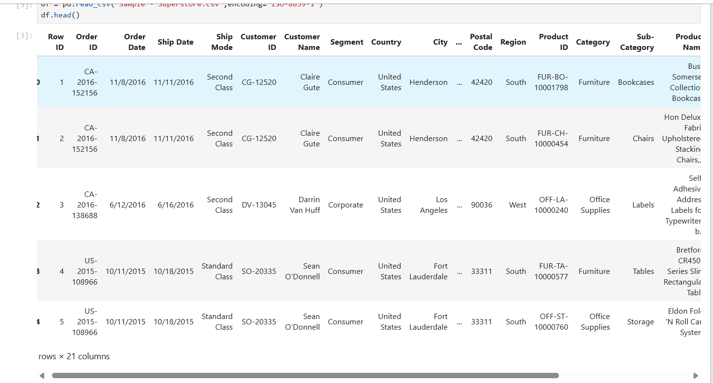
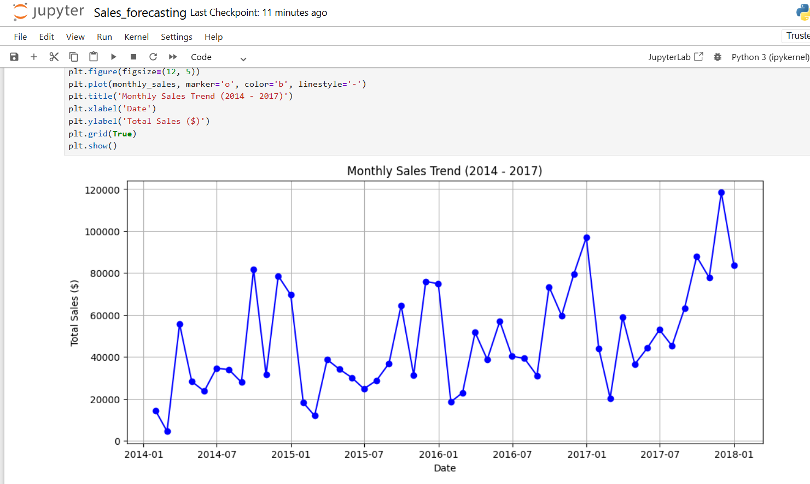
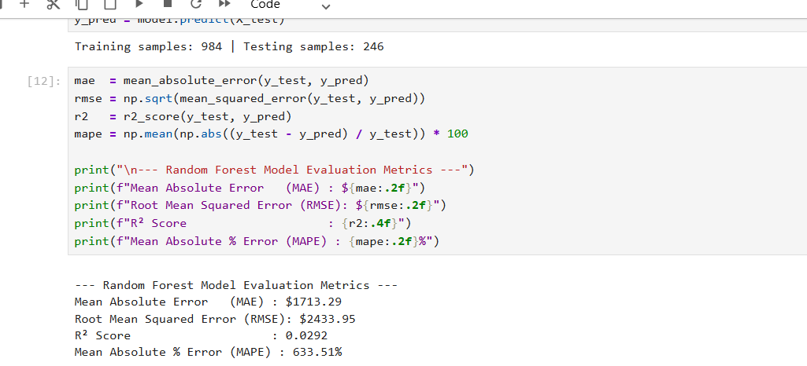
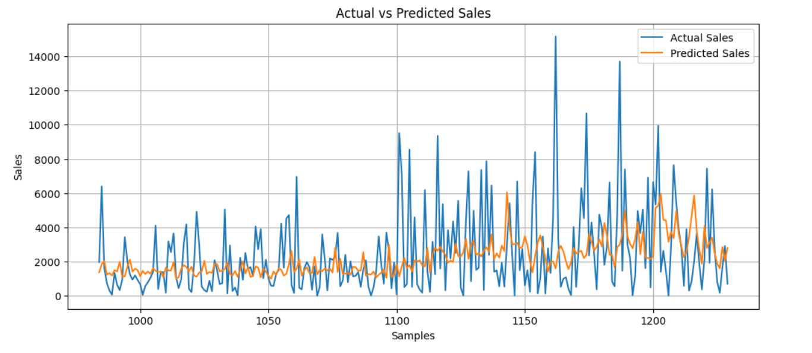
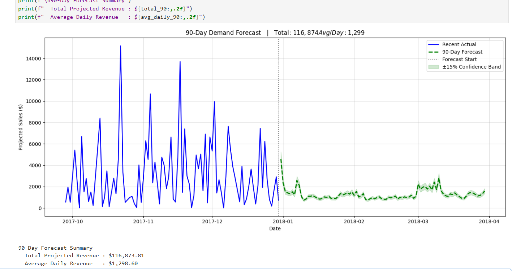

# 📈 Sales Forecasting Using Machine Learning

## 🚀 Project Overview

This project predicts future sales using historical sales data and Machine Learning techniques. A Random Forest Regressor model was trained on sales records to identify patterns and forecast future demand.

The objective of this project is to help businesses make data-driven decisions regarding inventory management, demand planning, and sales forecasting.

---

## 🎯 Objectives

* Analyze historical sales data
* Perform data preprocessing and feature engineering
* Train a Machine Learning model for sales prediction
* Evaluate model performance
* Forecast future sales trends
* Visualize actual vs predicted sales

---

## 🛠️ Technologies Used

* Python
* Pandas
* NumPy
* Matplotlib
* Scikit-Learn
* Jupyter Notebook

---

## 📂 Dataset

Dataset Used: **Sample Superstore Dataset**

The dataset contains information such as:

* Order Date
* Sales
* Profit
* Quantity
* Product Categories
* Customer Information

---

## 🤖 Machine Learning Model

### Random Forest Regressor

Random Forest is an ensemble learning algorithm that combines multiple decision trees to improve prediction accuracy and reduce overfitting.

### Why Random Forest?

* Handles non-linear relationships
* Works well on structured data
* Reduces overfitting compared to a single decision tree
* Provides robust predictions

---

## 📊 Project Workflow

1. Data Collection
2. Data Cleaning
3. Feature Engineering
4. Exploratory Data Analysis (EDA)
5. Model Training
6. Model Evaluation
7. Future Sales Forecasting
8. Visualization

---

## 📈 Results

The model was trained on historical sales data and successfully generated future sales forecasts.

Key outputs:

* Actual vs Predicted Sales Comparison
* Future Sales Forecast
* Model Performance Metrics

---

## 📷 Screenshots

### Dataset Preview



### Sales Trend Analysis



### Model Performance



### Actual vs Predicted Sales



### Future Sales Forecast



---

## 📁 Project Structure

```text
FUTURE_ML_01
│
├── Images/
│   ├── actual_vs_predicted.png
│   ├── dataset_preview.png
│   ├── future_forecast.png
│   ├── model_performance.png
│   └── sales_trend.png
│
├── Sales_forecasting.ipynb
├── Sample - Superstore.csv
├── demand_forecasting_predictions.csv
├── future_forecast_90days.csv
├── random_forest_demand_model.pkl
├── requirements.txt
└── README.md
```

## ▶️ Installation & Setup

### Clone the Repository

```bash
git clone https://github.com/your-username/sales-forecasting-ml.git
```

### Navigate to the Project Directory

```bash
cd sales-forecasting-ml
```

### Create a Virtual Environment (Optional)

```bash
python -m venv venv
```

Activate the environment:

**Windows**

```bash
venv\Scripts\activate
```

**Mac/Linux**

```bash
source venv/bin/activate
```

### Install Dependencies

```bash
pip install -r requirements.txt
```

### Run the Jupyter Notebook

```bash
jupyter notebook
```

Open:

```text
Sales_forecasting.ipynb
```

and run all cells to reproduce the analysis, model training, and forecasting results.

---

## 🔮 Future Improvements

* Deploy the model using Streamlit
* Use advanced forecasting techniques such as XGBoost and LSTM
* Create an interactive dashboard
* Integrate real-time sales data

---

## 👨‍💻 Author


**Aashi Tomar**

Machine Learning Enthusiast | AI & ML Student

Future Interns – Machine Learning Internship

LinkedIn:https://www.linkedin.com/feed/update/urn:li:activity:7474421070343892992/

---

## ⭐ Acknowledgement

This project was developed as part of the **Future Interns Machine Learning Internship Program**.

The objective of this task was to apply Machine Learning techniques to real-world business data and build a predictive sales forecasting system capable of estimating future demand based on historical sales trends.

Through this project, I gained hands-on experience in:

* Data Cleaning and Preprocessing
* Exploratory Data Analysis (EDA)
* Feature Engineering
* Machine Learning Model Development
* Model Evaluation and Validation
* Business Forecasting and Data Visualization

I would like to thank **Future Interns** for providing the opportunity to work on practical Machine Learning projects and enhance my skills in predictive analytics and data-driven decision making.
